# 将智慧餐厅打包成桌面APP

## 开发命令

```
npm install
npm run start
```

## 创建 Electron 项目

通常，一个Electron应用的结构类似下面：

```
your-app/
├── package.json
├── main.js
└── index.html
```

main.js 应当创建窗口并且处理系统事件，一个典型的例子如下：

``` javascript
const electron = require('electron');
// 控制应用生命周期的模块
const {app} = electron;
// 创建本地浏览器窗口的模块
const {BrowserWindow} = electron;

// 指向窗口对象的一个全局引用，如果没有这个引用，那么当该javascript对象被垃圾回收的
// 时候该窗口将会自动关闭
let win;

function createWindow() {
  // 创建一个新的浏览器窗口
  win = new BrowserWindow({width: 800, height: 600});

  // 并且装载应用的index.html页面
  win.loadURL(`file://${__dirname}/index.html`);

  // 打开开发工具页面
  win.webContents.openDevTools();

  // 当窗口关闭时调用的方法
  win.on('closed', () => {
    // 解除窗口对象的引用，通常而言如果应用支持多个窗口的话，你会在一个数组里
    // 存放窗口对象，在窗口关闭的时候应当删除相应的元素。
    win = null;
  });
}

// 当Electron完成初始化并且已经创建了浏览器窗口，则该方法将会被调用。
// 有些API只能在该事件发生后才能被使用。
app.on('ready', createWindow);

// 当所有的窗口被关闭后退出应用
app.on('window-all-closed', () => {
  // 对于OS X系统，应用和相应的菜单栏会一直激活直到用户通过Cmd + Q显式退出
  if (process.platform !== 'darwin') {
    app.quit();
  }
});

app.on('activate', () => {
  // 对于OS X系统，当dock图标被点击后会重新创建一个app窗口，并且不会有其他
  // 窗口打开
  if (win === null) {
    createWindow();
  }
});

// 在这个文件后面你可以直接包含你应用特定的由主进程运行的代码。
// 也可以把这些代码放在另一个文件中然后在这里导入。
```


## 打包

打包分为两步，第一步，将智慧餐厅通过 electron 打包成可执行的exe，里面包括 exe 和其他依赖文件；
第二步，通过 Inno setup 将上一步打包出来的文件夹打包成一个安装文件exe。

### electron 打包

```
npm install
npm install gulp -g 
gulp
```

##### [electron-package](https://github.com/electron-userland/electron-packager/blob/master/docs/api.md) API 介绍

- name: 应用程序的名字
- arch: 架构，可以指定的架构有ia32, x64, armv7l, all
- platform: 平台，可以指定的平台有linux, win32, darwin, mas, all
- version: 版本，决定了使用的 Electron 版本
- overwrite: 覆盖，是否替换现有的输出目录。
- asar: 压缩，是否将应用程序的源代码封装成一个使用 electron格式的压缩文件。好处： 避免直接暴露源代码。
- dir: 当前工作目录的路径
- out: 输出目录
- icon: 图标
- ignore: 忽略的文件，不参与 asar 的打包

### [Inno setup 打包](http://jingyan.baidu.com/article/295430f1232df70c7e0050fe.html)

1. [下载并安装 Inno setup](http://www.jrsoftware.org/isdl.php), 你也可以下载中文版的Inno setup 
2. 启动Inno setup, 选择创建新的空白脚本文件 
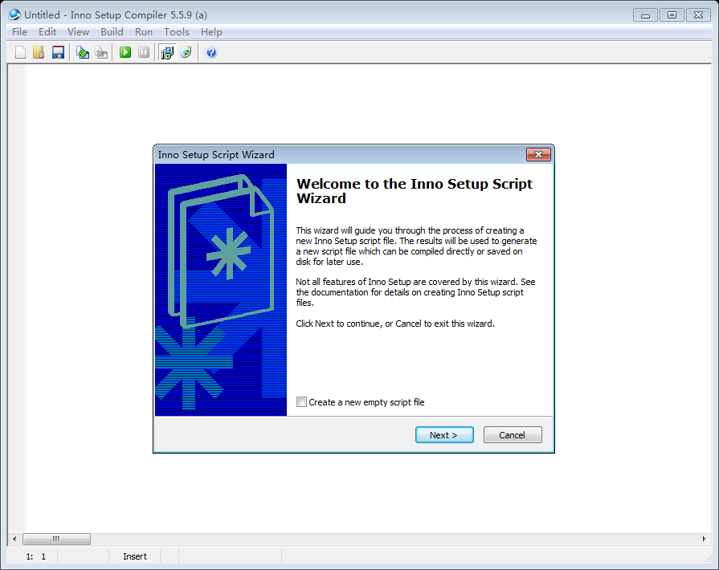
3. 然后点击下一步，在应用名称中输入产品的名称、版本号、公司网址等信息。最好在这里填写好，这样就会自动生成在脚本中，不需要修改。
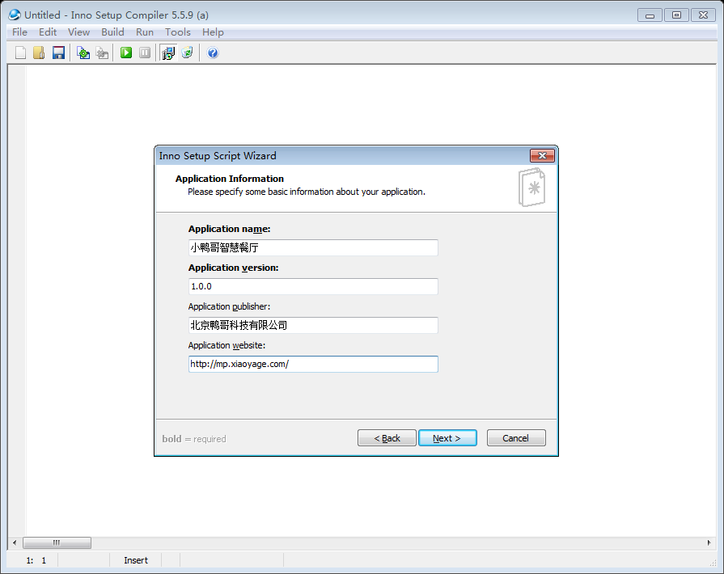
4. 然后点击下一步，选择打包好的文件，输出地址，以及输出的文件夹名字。
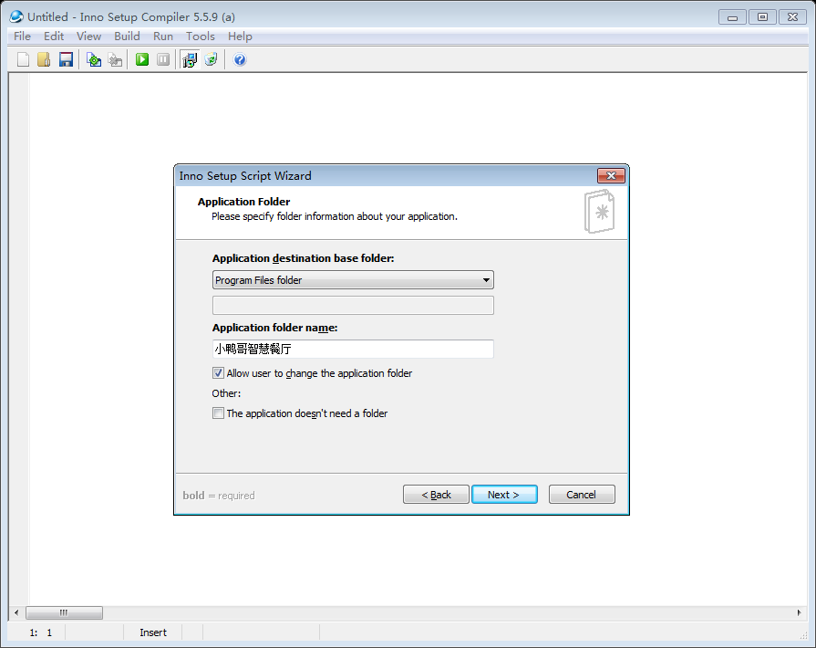
5. 然后点击下一步，选择应用的主启动程序（就是通过 electron 打包生成的 exe 文件）；然后点击 Add folder,把剩下的文件全部添加进来。
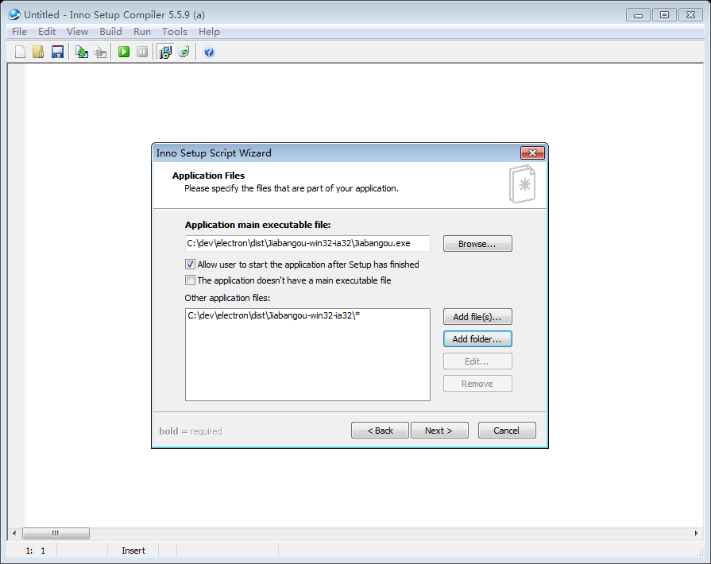
6. 然后点击下一步，输入应用程序在开始菜单中显示的名字 
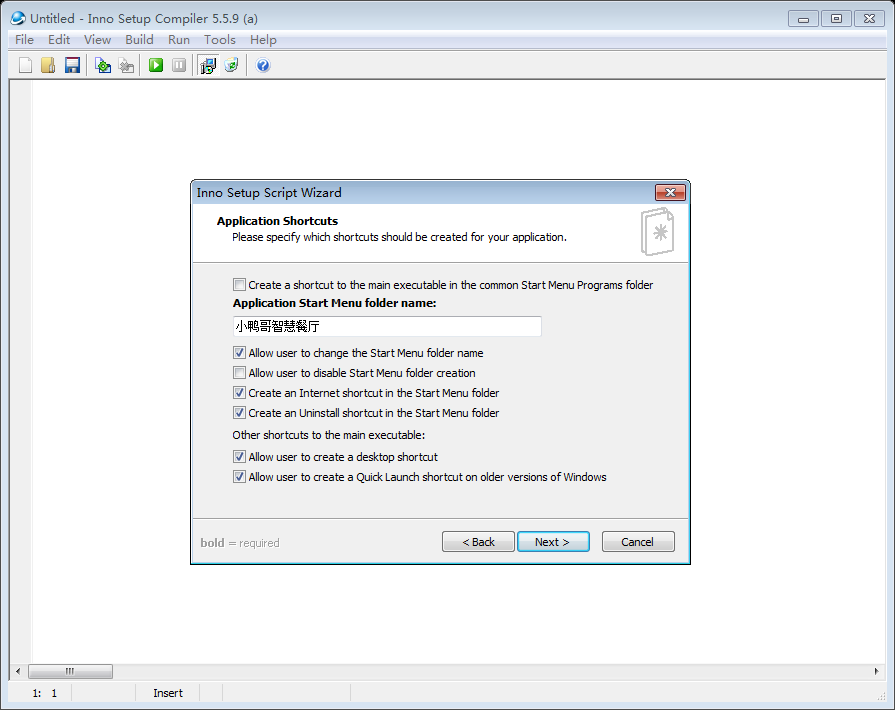
7. 点击下一步，选择在安装时需要显示的信息、安装语言、安装名称等。若无中文包，[可以在这下载](document/Languages/ChineseSimplified.isl)
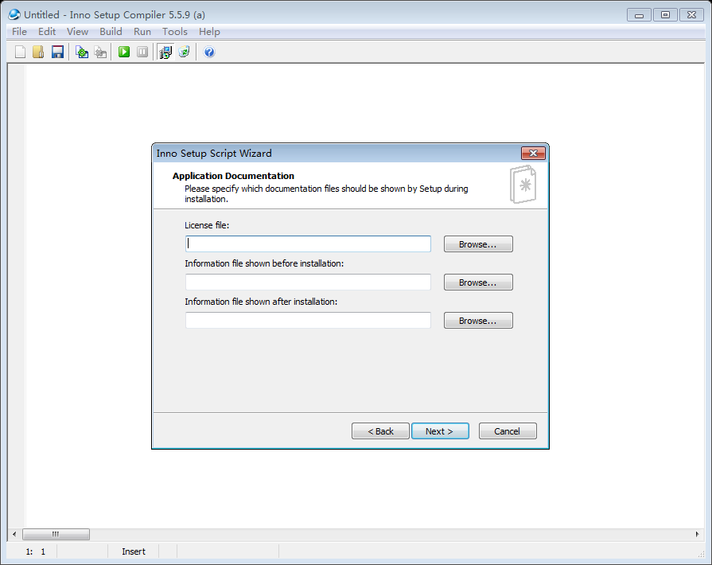 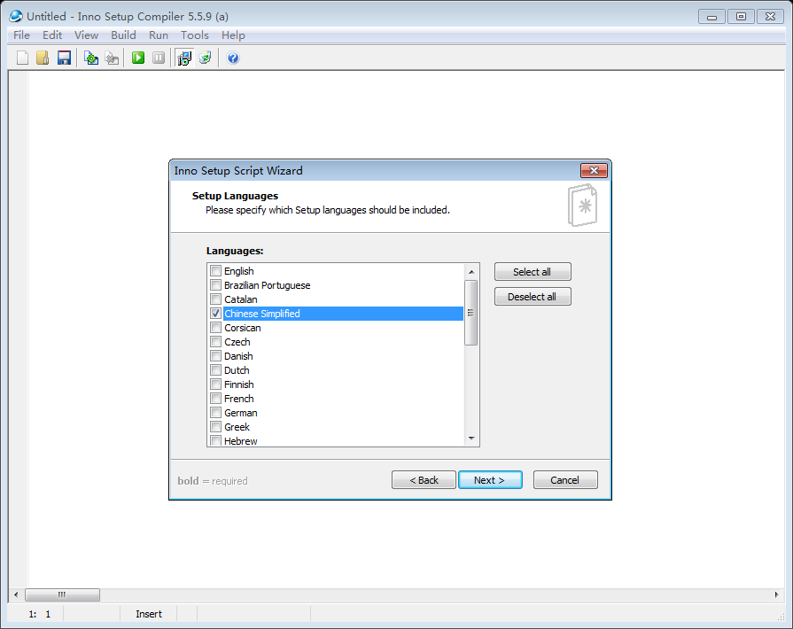 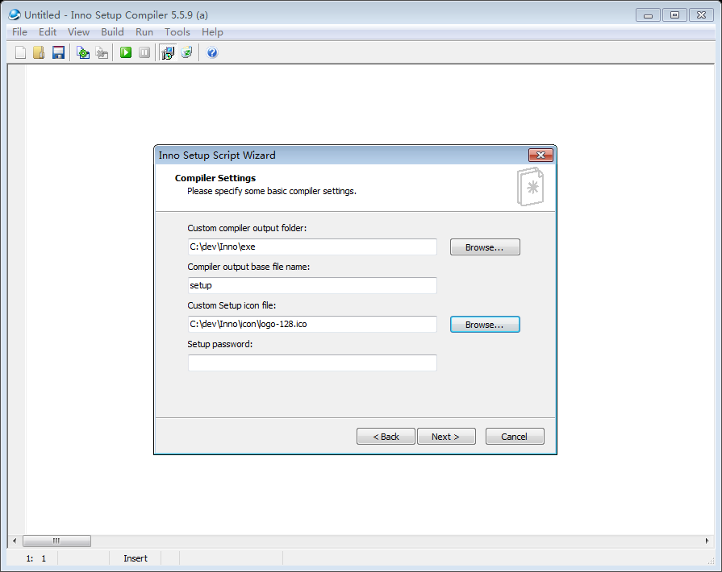
8. 最后，点击完成，那么打包的脚本就生成好了.
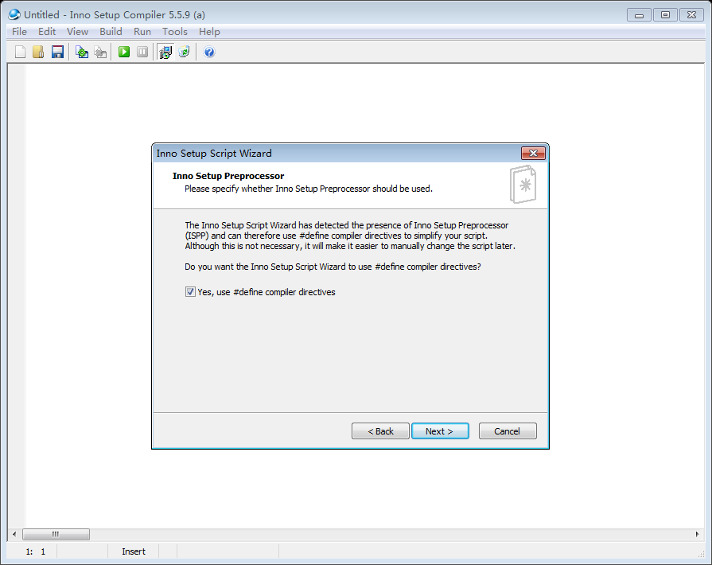 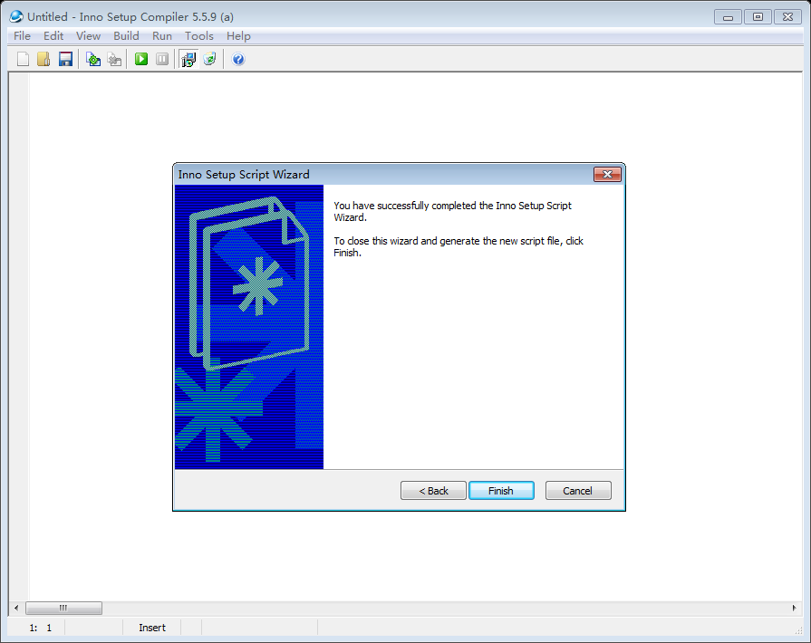
9. 最后,在第七步设置的输出目录，找到 setup.exe 安装即可.
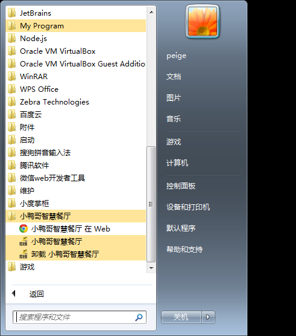

注意 在我们创建出脚本文件之后，需要对脚本文件做一些修改。比如，让 `创建桌面图标` 默认勾选，添加打印机安装包，配置 安装打印机任务等。

在 [Tasks] 中 找到 Name: "desktopicon"; 的任务，去掉末尾的Flag: unchecked;
在 项目目录下的 Lodop 文件夹找到 CLodop_Setup_for_Win32NT.exe 放到 electron 打包的目录下 也就是 out 配置下的目录。
在 [Run] 中 添加 如下命令 `Filename: "{app}\CLodop_Setup_for_Win32NT.exe"; Description: "安装打印机插件"; Flags: postinstall skipifsilent shellexec`

### 在 meicanyun 项目中使用 electron

首先，安装 electron-prebuilt 组件

```
npm install electron-prebuilt --save-dev
(如果依赖中已经有了，直接npm install)
```

然后，引入 electron

```
try {
const electron = window.require('electron');
const {ipcRenderer, shell, remote} = electron;
...
}
catch (err) {}
```

不能通过 import 方式引入。webpack可以对babel和jsx进行转义，并打包压缩。我们只对属于UI进程的js和css进行打包和压缩，
而对主进程的代码不压缩。主进程代码跑在nodejs的环境中，webpack打包会破坏__dirname和__filename机制。
[参考这里](https://my.oschina.net/xpbug/blog/637864)


## 参考链接:
[electron 中文文档](https://github.com/electron/electron/tree/master/docs-translations/zh-CN)    
[使用 Electron 构建桌面应用](https://zhuanlan.zhihu.com/p/20225295)    
[Electron 打包](https://segmentfault.com/a/1190000006210020)    
[electron-packager API](https://github.com/electron-userland/electron-packager/blob/master/docs/api.md)